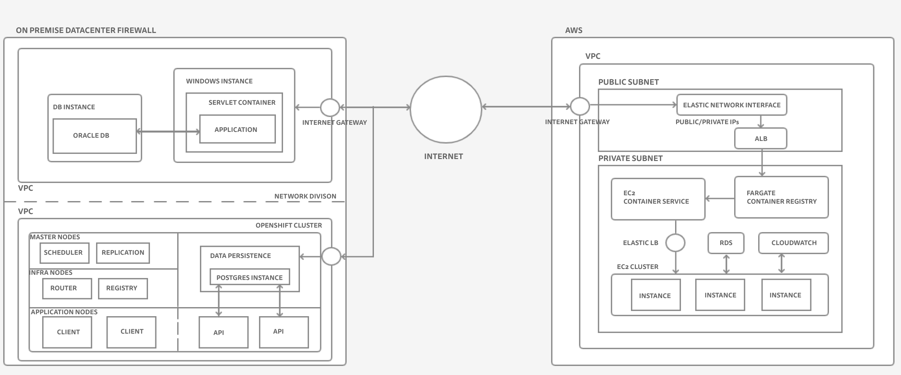

# BCGov Test Challenge

## Part 1

Here are a few observations after going through the repositories of the 
open-source projects listed in the document.

- All the repositories are from the **bcgov** GitHub account and are public repos.
- Some of these repos are still active while the rest are in an archived state.
- Some of these listed repos power the backend applications while the rest power 
the frontend.
- There are a couple of repos that serve just as documentation for the devs who 
wish to contribute.
- The predominant tech stack is Angular for the frontend applications 
and NodeJS for the backend applications, typically built over MEAN stack.
- Containerization and Orchestration is taken care by the 
[Openshift](https://www.redhat.com/en/technologies/cloud-computing/openshift) platform.
- Eagle is the revised name for the EAO EPIC application suite.

Coming to the question of who has led the technical vision on the set of given
open-source projects, here are the probable five users.
1. [severinbeauvais](https://github.com/severinbeauvais)
2. [marklise](https://github.com/marklise)
3. [jeznorth](https://github.com/jeznorth)
4. [NickPhura](https://github.com/NickPhura)
5. [popkinj](https://github.com/popkinj)

I've gone through the contributors list of all the listed repositories and came
up with the users who have maximum commits in a given repo. I've then made sure
that they've contributed across all the listed repos and came up with the top 5
users. The above is done taking a cue from the documentation to get start on the
[BC dev platform](https://developer.gov.bc.ca/Getting-Started-on-the-DevOps-Platform/How-to-request-new-GitHub-user-access-or-repository-creation).

The common architectural pattern that is observed in the repos are that they are
part of an application suite following a flavour of *SOA*. The application suite
contains a backend application that communicates with one or more frontends over
http(s) protocol using *JSON* as the preferred data exchange format. Each of these 
applications are developed and deployed using containerization and orchestration
solutions of RedHat Openshift platform. 

Given access to the application source code at the moment and not the deployment
infrastructure from where they are served, I can't comment categorically on their
common pitfalls other than highlighting SOA vs Microservices debate. You can find
some [here](https://dzone.com/articles/microservices-vs-soa-is-there-any-difference-at-al)
and [here](https://www.ibm.com/cloud/blog/soa-vs-microservices). 

## Part 2

Here is the logical diagram of the 3 applications mentioned in Part 2.

The datacenter, considered to be on-premise has multiple application suites
deployed across different networks on the same center giving them enough 
abstraction from each other. Do some research and complete the rest of the 
writeup focussing on how data is transferred across the different applications.
Also consider explaining how the security aspect ios factored in. In case we are
sure of any changes that might add value, include them.

## Part 3

The write-up based on the business problem comes here. Do an internet search, find
few quality write-ups, and extract a summary from them covering the most
important topics.

# Part 4

To be continued.

